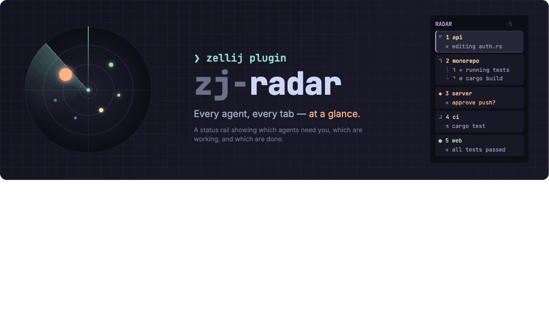
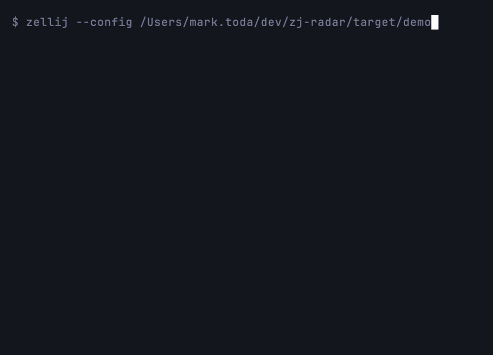

# zj-radar

<p align="center">
  <a href="https://github.com/marktoda/zj-radar/actions/workflows/ci.yml">
    
  </a>
  <a href="LICENSE">
    
  </a>
  
  
  
  
</p>

<p align="center">
  <a href="#quick-start">Quick start</a> ·
  <a href="#how-it-works">How it works</a> ·
  <a href="#how-is-this-different">How is this different?</a> ·
  <a href="#configuration">Configuration</a> ·
  <a href="docs/producers.md">Producers</a>
</p>

A native [Zellij](https://zellij.dev) **sidebar** that shows live AI-agent
status for every tab — *working*, *waiting for you*, *done*, or *error* — with
repo·branch, elapsed time, and the last message. Click a row to jump to that
tab.



`◆ needs you` · `⠋ working` · `● done` · `✗ error` · `○ idle / plain terminal`

*Live in a real session:*



## What is it?

Agents like Claude Code spend long stretches working, then quietly block on a
permission prompt or finish. In a many-tab Zellij session it's easy to lose
track of which agent needs you. zj-radar surfaces that at a glance, in a pinned
left column that survives swap-layout cycling — without launching, owning, or
wrapping your agents. It's a status rail for the session you already run.

## Highlights

- See which Claude Code / Codex tabs are **working, done, errored, or waiting for you**.
- **Jump directly** to the tab that needs attention (`attention-next` keybind).
- Keep your existing Zellij workflow — **no new terminal, no tmux wrapper, no agent orchestrator**.
- **Push-driven** updates via `zellij pipe`; no pane polling, no blocking host queries.
- Works with **Claude Code** today, **Codex** via the native CLI, and any
  [custom producer](docs/producers.md#writing-your-own-producer) that can send JSON.

## Quick start

```sh
# 1. Build the sidebar wasm + install the CLI
git clone https://github.com/marktoda/zj-radar
cd zj-radar
cargo build --release --target wasm32-wasip1
cargo install --path . --features cli

# 2. Install the wasm + register the `radar` alias in config.kdl
zj-radar setup zellij --wasm target/wasm32-wasip1/release/zj_radar.wasm

# 3. Add the sidebar to a layout (prints a snippet to paste), then start Zellij
```

Then add a **producer** so the rail has something to show — for Claude Code:

```sh
/plugin marketplace add marktoda/zj-radar
/plugin install zj-radar-claude@zj-radar
```

Full details, manual setup, layout templates, and Nix/home-manager are in
**[`docs/install.md`](docs/install.md)**. Codex and custom producers are in
**[`docs/producers.md`](docs/producers.md)**.

## How it works

zj-radar is **push-driven, not poll-driven**: status arrives via an explicit
`zellij pipe` broadcast from per-agent hooks. The plugin never issues blocking
host queries (`get_pane_running_command`, etc.). This is a deliberate, hard
constraint — the predecessor plugin (`smart-tabs`) melted a many-agent session
by polling every pane on every output event; see
[`docs/smart-tabs-postmortem.md`](docs/smart-tabs-postmortem.md).

The wire format is a single versioned JSON payload (`zj_radar.status.v1`), so a
"producer" is anything that can broadcast it — the bundled Claude Code plugin,
the `zj-radar notify` CLI for Codex, or your own script. The sidebar pins itself
into your tab templates (the same mechanism Zellij's own status bar uses), so it
appears in every tab and survives swap-layout cycling.

## How is this different?

| Tool | Best for | How `zj-radar` differs |
|---|---|---|
| [Claude Squad](https://github.com/smtg-ai/claude-squad) | Running multiple agents in isolated git worktrees from one TUI. | `zj-radar` does not launch or own agents; it shows status inside the Zellij session you already use. |
| cmux | A macOS terminal with vertical tabs, notifications, browser panes, and agent-aware UI. | `zj-radar` is a Zellij plugin, not a new terminal app. |
| [zjstatus](https://github.com/dj95/zjstatus) | Replacing / customizing the Zellij status bar. | `zj-radar` is an agent-status rail; it leaves your existing status bar alone. |
| Plain Zellij tabs | Manual multiplexing. | `zj-radar` adds agent state, elapsed time, messages, and jump-to-attention behavior. |

The short version: **inside your existing Zellij, push-driven, not an
orchestrator, not a new terminal.**

## Configuration

With the recommended alias setup, defaults live in `~/.config/zellij/config.kdl`:

```kdl
plugins {
    radar location="file:~/.config/zellij/plugins/zj_radar.wasm" {
        density "comfortable"   // cards · comfortable · compact
        naming "off"            // off · managed · force
    }
}
```

Options can also be changed **at runtime** — no layout edit — by broadcasting a
flat JSON object on a pipe:

```sh
zellij pipe --name zj_radar.config.v1 -- '{"density":"compact","header":false}'
```

The full option table, keybindings for runtime config, and `attention-next` /
`attention-prev` command bindings are in
**[`docs/configuration.md`](docs/configuration.md)**.

## Producers

A producer broadcasts agent status to the sidebar. zj-radar ships two and
documents the wire format so you can write your own:

- **Claude Code** — a Claude plugin that auto-registers status hooks (no
  `settings.json` editing).
- **Codex / native CLI** — `zj-radar notify` + `zj-radar setup codex`.
- **Custom** — broadcast a `zj_radar.status.v1` JSON payload from anything.

See **[`docs/producers.md`](docs/producers.md)** for install steps, the payload
schema, and a copy-paste smoke test.

## Documentation

| Doc | What's in it |
|-----|--------------|
| [`docs/install.md`](docs/install.md) | Full sidebar install: CLI + manual setup, layout templates, permissions, remote-URL caveat, Nix / home-manager. |
| [`docs/producers.md`](docs/producers.md) | Claude Code, Codex, and writing your own producer (payload schema + smoke test). |
| [`docs/configuration.md`](docs/configuration.md) | Density/naming/header/glyphs, runtime config, and keybindings. |
| [`docs/troubleshooting.md`](docs/troubleshooting.md) | The two-template rule, first-run prompt coordination, and reload quirks. |
| [`docs/design.md`](docs/design.md) | The canonical living design. |
| [`docs/smart-tabs-postmortem.md`](docs/smart-tabs-postmortem.md) | Why the polling predecessor was scrapped (the push-driven origin story). |

## Status & roadmap

- ✅ **Sidebar plugin** — tab list, click-to-switch, per-tab agent aggregation,
  overflow folding, theme-derived card surfaces, runtime config.
- ✅ **Claude Code producer** — ships as a Claude plugin (`plugins/zj-radar-claude`).
- ✅ **`zj-radar` CLI** — native, jq-free `notify` (Claude + Codex) and
  conflict-aware `setup`; see [`docs/producers.md`](docs/producers.md#codex-and-the-native-cli).
- 📋 **Not yet built** — cross-platform prebuilt release binaries and a
  fully automatic layout patcher. See [`docs/distribution.md`](docs/distribution.md).

## Development

```sh
cargo test                                # host tests, no wasm needed
./dev/run.sh                              # build + open the dev session
```

Run `./dev/run.sh` from either a normal terminal or inside Zellij. It builds
`target/wasm32-wasip1/debug/zj_radar.wasm` and generates `target/dev/dev.kdl`
with an absolute plugin path. Outside Zellij it restarts the disposable
`zj-radar-dev` session. Inside Zellij it leaves the current session unchanged;
use `./dev/run.sh --fresh-session` when you explicitly want to switch the
current client to a fresh disposable dev session. If the current Rust toolchain
is missing `wasm32-wasip1`, the script uses the repo's Nix flake automatically.

The hero GIF is reproducible — its VHS tape and recording script live in
[`demo/`](demo/) (`demo/record.sh`).

### Repo layout

| Path | What it is |
|------|------------|
| `src/` | The Zellij sidebar plugin (Rust → `wasm32-wasip1`). Thin Zellij adapter, pure runtime, stores, model, and renderer. |
| `plugins/zj-radar-claude/` | A **Claude Code plugin** that broadcasts agent status via hooks — no `settings.json` editing. |
| `docs/` | Design, plan, and postmortem docs. `design.md` is the canonical living design. |
| `demo/` | The reproducible VHS tape + script behind the hero GIF. |
| `dev/dev.kdl` | A dev layout for dogfooding the debug plugin while building. |

The host-testable modules (`status`, `payload`, `radar_state`, `rollup`, `render`,
`tab_namer`, `command`, `config`, `theme`, `session_files`) carry no `zellij-tile`
dependency and are covered on the host target. Only `lib.rs`/`main.rs` touch the
Zellij host API and are gated behind `#[cfg(target_arch = "wasm32")]`. See
[`docs/TOOLCHAIN.md`](docs/TOOLCHAIN.md).

## Contributing

Issues and PRs welcome. See [`CONTRIBUTING.md`](CONTRIBUTING.md) for build/test
layers, the no-`rustfmt` rule, and the two load-bearing invariants
(push-driven, rail lockstep). [`CONTEXT.md`](CONTEXT.md) is the domain glossary —
the fastest way to orient before touching the core.

## License

MIT — see [`LICENSE`](LICENSE).
